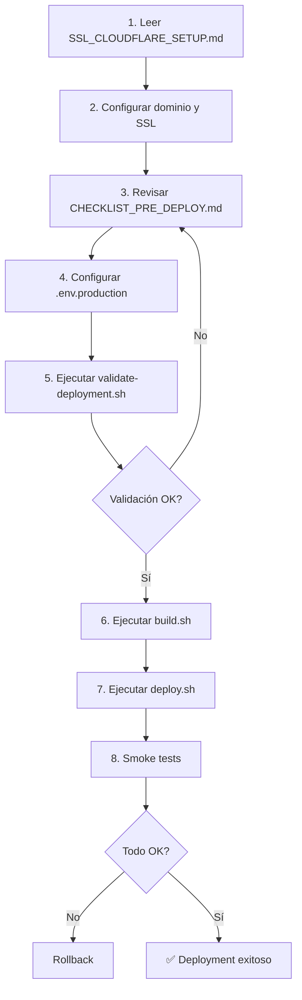
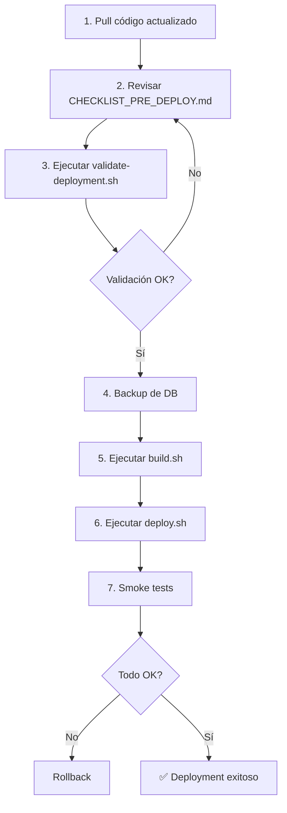

# 📚 Documentación de Deployment - Arconte

Bienvenido a la documentación de deployment de Arconte. Esta carpeta contiene toda la información necesaria para desplegar la aplicación en producción.

---

## 📁 Contenido

### 🔍 [HOSTING_COMPARISON.md](./HOSTING_COMPARISON.md) ⭐ **EMPIEZA AQUÍ**
**Guía de decisión: ¿Railway o VPS?**

Comparativa completa para elegir la mejor opción:
- Railway (PaaS) vs VPS (IaaS)
- Comparativa de costos detallada
- Matriz de decisión por nivel técnico
- Proveedores recomendados (Hetzner, DigitalOcean, Linode)
- Plan de migración entre opciones

**¿Cuándo usar?** ANTES de elegir dónde deployar

**Tiempo estimado:** 15 minutos de lectura

---

### 🚂 [RAILWAY_DEPLOYMENT.md](./RAILWAY_DEPLOYMENT.md)
**Deploy en Railway (PaaS) - Opción Rápida**

Guía paso a paso para deploy en Railway:
- Setup en 15 minutos
- No requiere DevOps skills
- Auto-scaling incluido
- SSL automático
- PostgreSQL y Redis incluidos

**¿Cuándo usar?** MVP, startups, deploy rápido

**Costo:** $25-45/mes

**Nivel:** ⭐ Principiante

---

### 🖥️ [VPS_DEPLOYMENT.md](./VPS_DEPLOYMENT.md)
**Deploy en VPS - Opción Económica**

Guía completa para VPS (DigitalOcean, Hetzner, Linode):
- Preparación del servidor
- Instalación de Docker
- Configuración de firewall
- Backups automáticos
- Monitoring

**¿Cuándo usar?** Producción, control total, presupuesto ajustado

**Costo:** $5-20/mes

**Nivel:** ⭐⭐⭐ Intermedio/Avanzado

---

### 🔒 [SSL_CLOUDFLARE_SETUP.md](./SSL_CLOUDFLARE_SETUP.md)
**Configuración de SSL con Cloudflare**

Guía completa paso a paso para:
- Registrar y configurar dominio en Cloudflare
- Generar certificados SSL Origin
- Configurar DNS records
- Habilitar firewall y protección DDoS
- Optimizar performance con CDN

**¿Cuándo usar?** Antes del primer deployment (Railway o VPS)

**Tiempo estimado:** 1-2 horas (incluye propagación DNS)

---

### ✅ [CHECKLIST_PRE_DEPLOY.md](./CHECKLIST_PRE_DEPLOY.md)
**Checklist completo pre-deployment**

Lista de verificación exhaustiva con 72 items organizados en:
- Infraestructura
- Dominio y SSL
- Variables de entorno
- Base de datos
- Seguridad
- APIs externas
- Testing
- Monitoring
- Backups
- Documentación

**¿Cuándo usar?** Antes de CADA deployment a producción

**Cómo usar:**
1. Imprimir o abrir en pantalla
2. Revisar cada item
3. Marcar checkboxes
4. Resolver items pendientes
5. Obtener aprobaciones

---

### 🚀 [PRODUCTION_DEPLOYMENT.md](../../PRODUCTION_DEPLOYMENT.md)
**Guía completa de despliegue (Docker Compose)**

Documentación técnica detallada sobre:
- Estructura del proyecto
- Configuración inicial
- Proceso de deployment
- Monitoreo y logs
- Actualización y rollback
- Mantenimiento
- Troubleshooting

**¿Cuándo usar?** Referencia técnica durante deployment

**Ubicación:** `PRODUCTION_DEPLOYMENT.md` (raíz del proyecto)

---

## 🛠️ Scripts Disponibles

Todos los scripts están en `/scripts/production/`:

### Build
```bash
./scripts/production/build.sh
```
Construye las imágenes Docker para producción.

### Deploy
```bash
./scripts/production/deploy.sh
```
Despliega la aplicación completa (incluye migraciones y optimizaciones).

### Rollback
```bash
./scripts/production/rollback.sh v1.0.0
```
Revierte a una versión anterior.

### Validación
```bash
./scripts/production/validate-deployment.sh
```
Valida que todo esté listo para deployment.

---

## 🎯 Flujo Recomendado de Deployment

### Primera vez (Initial Deployment)



### Deployments Subsecuentes



---

## 📋 Quick Start

### Paso 1: Elegir Hosting 🔍

**Lee primero:** [HOSTING_COMPARISON.md](./HOSTING_COMPARISON.md)

**Decisión rápida:**
- ¿Necesitas deploy YA? → **Railway**
- ¿Presupuesto ajustado? → **VPS**
- ¿Sin conocimientos DevOps? → **Railway**
- ¿Control total? → **VPS**

### Paso 2A: Deploy en Railway 🚂

**Sigue:** [RAILWAY_DEPLOYMENT.md](./RAILWAY_DEPLOYMENT.md)

**Resumen:**
1. Conectar GitHub repo
2. Crear PostgreSQL y Redis
3. Configurar variables de entorno
4. Deploy automático
5. Configurar dominio

**Tiempo:** 15-30 minutos
**Costo:** $25-45/mes

### Paso 2B: Deploy en VPS 🖥️

**Sigue:** [VPS_DEPLOYMENT.md](./VPS_DEPLOYMENT.md)

**Resumen:**
1. Crear VPS (Hetzner/DigitalOcean)
2. Instalar Docker
3. Clonar repositorio
4. Configurar `.env.production`
5. Ejecutar scripts de deployment

**Tiempo:** 1-2 horas
**Costo:** $5-20/mes

### Paso 3: Configurar SSL 🔒

**Sigue:** [SSL_CLOUDFLARE_SETUP.md](./SSL_CLOUDFLARE_SETUP.md)

**Aplica para:** Railway y VPS

**Resumen:**
1. Registrar dominio
2. Configurar Cloudflare DNS
3. Generar certificados SSL
4. Configurar firewall

**Tiempo:** 1-2 horas (incluye propagación)

### Paso 4: Validación Final ✅

**Sigue:** [CHECKLIST_PRE_DEPLOY.md](./CHECKLIST_PRE_DEPLOY.md)

**Antes de go-live:**
1. Revisar 72 items del checklist
2. Ejecutar `./scripts/production/validate-deployment.sh`
3. Smoke tests
4. Monitoring configurado

---

## ⚠️ Consideraciones Importantes

### Seguridad

- ❌ **NUNCA** commitear `.env.production` en Git
- ✅ Usar contraseñas de 16+ caracteres
- ✅ Habilitar SSL/TLS Full (strict)
- ✅ Configurar firewall (UFW)
- ✅ Habilitar rate limiting

### Performance

- ✅ Usar Redis para cache y sesiones
- ✅ Habilitar OPcache en PHP
- ✅ Configurar CDN de Cloudflare
- ✅ Optimizar imágenes Docker (multi-stage builds)
- ✅ Gzip compression en Nginx

### Backups

- ✅ Backup diario de base de datos
- ✅ Retención de 30 días
- ✅ Backup antes de cada deployment
- ✅ Test de restore periódicamente

### Monitoring

- ✅ Health checks configurados
- ✅ Uptime monitoring (UptimeRobot)
- ✅ Error logs monitoreados
- ✅ Alertas configuradas

---

## 🆘 Troubleshooting

### "Validación falla"
→ Revisar output de `validate-deployment.sh`
→ Resolver checks fallidos uno por uno
→ Re-ejecutar validación

### "Build falla"
→ Revisar logs: `docker-compose logs <servicio>`
→ Verificar Dockerfile sintaxis
→ Verificar dependencias en composer.json/package.json

### "Deploy exitoso pero app no responde"
→ Verificar health checks: `curl http://localhost/health`
→ Revisar logs: `docker-compose logs -f`
→ Verificar puertos abiertos: `sudo ufw status`

### "SSL no funciona"
→ Verificar certificados en nginx/ssl/
→ Verificar configuración en nginx/conf.d/default.conf
→ Verificar Cloudflare SSL mode: Full (strict)

---

## 📞 Soporte

**Documentación:**
- Laravel: https://laravel.com/docs
- Docker: https://docs.docker.com
- Cloudflare: https://developers.cloudflare.com

**Issues:**
- GitHub: https://github.com/1128026Go/Arconte/issues

**Contacto:**
- Email: soporte@arconte.com

---

## 📝 Checklist Rápido

Antes de deployment, verificar:

- [ ] `.env.production` configurado
- [ ] SSL certificados instalados
- [ ] DNS apuntando correctamente
- [ ] Validación exitosa (`validate-deployment.sh`)
- [ ] Backup de DB creado
- [ ] Checklist pre-deploy completado
- [ ] Ventana de mantenimiento comunicada
- [ ] Plan de rollback listo

---

## 🔄 Versionado

**Versión actual de documentación:** 1.0.0
**Última actualización:** 2024

### Changelog

**v1.0.0 (2024)**
- Documentación inicial de deployment
- SSL/Cloudflare setup guide
- Checklist pre-deployment
- Scripts de validación

---

**¿Listo para deployar?** 🚀

Comienza por el [Checklist Pre-Deployment](./CHECKLIST_PRE_DEPLOY.md)
